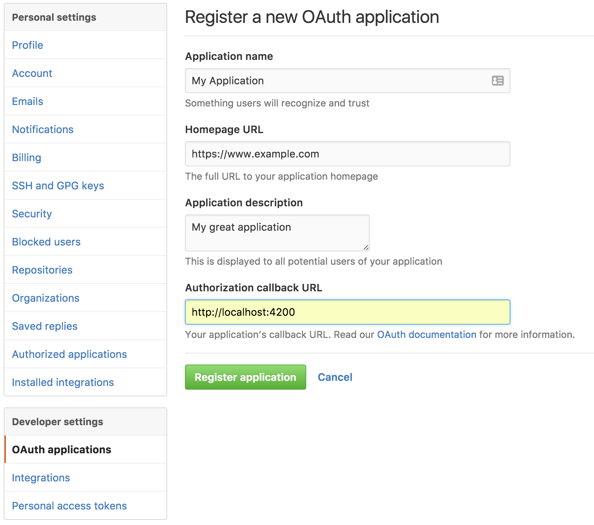

[Back to Main README](../README.md)

# Full GitHub Authorization with the `torii-provider`

This guide walks through the process of authenticating and authorizing an Ember app with
and for use against GitHub using `ember-simple-auth` and `torii` including a registered
GitHub application, an unauthenticated login route, an authenticated content route, a
token exchange service, and use of an authorizer to inject the token into
requests. We'll use the [ember-data-github](https://github.com/elwayman02/ember-data-github)
addon so we don't need to create our own GitHub models, serializers, and adapters.

The overall flow, concerns, and approach are the same for all OAuth2 explicit grant flow
mechanisms like Facebook, Google, etc. The differences could be as small as changing some
configuration and base classes.

This guide assumes you know how to start an Ember app and are familiar with the various
files and concepts.

## Registering your app with GitHub

Go to your GitHub Settings, choose `OAuth Applications`, and press the `Register a new
application` button. Fill in the fields similar to the following.



You will likely want to register different application keys for different deployment stages
because of the differences in the `Authorization callback URL`.

Once you register your application, you will have a chance to add an application logo.
Most importantly, you will be given a client ID and a client secret. _The client secret must be
kept secret and should never be included in the Ember application's source!_
You will use the client ID in your web application and the client secret in your
back end token exchange service.

## Authenticating the Ember app

OAuth is officially an authorization protocol, but is commonly used also for
authentication when the initial authorization code is obtained over `https`. GitHub uses
the OAuth [authorization code grant type](https://tools.ietf.org/html/rfc6749#section-4.1),
which requires two steps. The first step uses your client ID to get a temporary
authorization code. The temporary authorization code acts as a single use bridge
to authorization. The second step takes that authorization code and sends it to
your token exchange service which combines it with your client secret to obtain
an authorization token. That token is effectively your unique password to use
the GitHub APIs as long as it is valid.

### Installing the addons

Install `ember-simple-auth` and `torii`.

```
ember install ember-simple-auth
ember install torii
```

### Configuration

The next step is to set up the configuration. You want your effective configuration in `config/environment.js` to look
like this.

```js
// DON'T TYPE THIS. THIS IS THE EFFECTIVE RESULT.

var ENV = {
  ...

  torii: {
    sessionServiceName: 'session',
    providers: {
      'github-oauth2': {
        apiKey: 'YOUR_API_KEY',
        redirectUri: 'http://localhost:4200',
        scope: 'repo user'
      }
    }
  }
};
```

`YOUR_API_KEY` is the client ID supplied when you registered your GitHub application.

However, this API key is probably specific to your development environment, as is the value given for `redirectUri`
above. This is fine while your app is in development, but as your application approaches production, you'll need to
break some of it out.

Additionally, it can be considered bad practice to distribute all of your API keys in your source code. Let's add a
little complexity and address this concern by using `ember-cli-dotenv` to put our key in an external file that will be
injected at build time. Install the package

```js
ember install ember-cli-dotenv
```

and create a `.env` file in the root of your project like

```
GITHUB_DEV_CLIENT_ID=<YOUR_API_KEY>
```

replacing `<YOUR_API_KEY>` with the client ID from your application registration. Add `/.env` to your `.gitignore` file
so it will not be committed.

Break the configuration into the stage-specific parts of your `environment.js` like so.

```js
  var ENV = {
    ...

    torii: {
      sessionServiceName: 'session',
      providers: {
        'github-oauth2': {
          scope: 'repo user'
        }
      }
    }
  };

  if(environment === 'development') {
    ENV.torii.providers['github-oauth2'].apiKey = process.env.GITHUB_DEV_CLIENT_ID;
    ENV.torii.providers['github-oauth2'].redirectUri = 'http://localhost:4200';
  }
```

The values in the `development` block are the ones specific to that stage. You may choose to reuse those for the `test`
stage, but you will need different ones for `production` as at least the API key will change and you will almost
definitely host the application under a domain name. We will add to the `development` block later.

### The Basic App

Let's give ourselves an app to secure. We'll keep it simple. We'll have a login route for authentication and use the
application index route to display the authenticated user's data, an operation that gives a 401 if you aren't
authenticated.

```
ember g route application
ember g controller application
ember g route index
ember g route login
```

Also, now is a good time to remove `ember-welcome-page` from your `package.json`.

Let's put some content in our templates. First, our `application.hbs` will give a friendly greeting and some useful
information so we know things are working as we proceed.

```handlebars
<!-- app/templates/application.hbs -->

<h1>Welcome to the Demo App!</h1>

API Key: {{config.apiKey}} <br />

{{#if session.isAuthenticated}}
    Authenticated
{{else}}
    Unauthenticated
{{/if}}

<hr />

{{outlet}}
```

```js
// app/controllers/application.js

import Ember from 'ember';
import config from '../config/environment';

export default Ember.Controller.extend({
  session: Ember.inject.service(),
  config: config.torii.providers['github-oauth2']
});
```

For the `index.hbs` let's put a placeholder until we're ready to fill in real data.

```handlebars
{{!-- app/templates/index.hbs}}

<h1>Me</h1>
```

Finally, we'll put a placeholder in `login.hbs`. We'll give it behavior shortly.

```handlebars
{{!-- app/templates/login.hbs}}

<button>Log in to GitHub</button>
```

We can ignore the rest of the generated files for this step.
 
You can test the app so far by running `ember serve` and pointing your browser to `http://localhost:4200/` and
`http://localhost:4200/login`.

### Adding Authentication

We added the configuration for our authentication, but we didn't yet add the pieces that use it. Let's do that first.

```
ember g authenticator torii
```

and we'll modify our application and routes with some useful mixins.

First, we'll add the [ApplicationRouteMixin](http://ember-simple-auth.com/api/classes/ApplicationRouteMixin.html) to
our application route. This is optional, but adds methods supporting the authentication lifecycle that we would
otherwise have to implement explicitly.

```js
import Ember from 'ember';
import ApplicationRouteMixin from 'ember-simple-auth/mixins/application-route-mixin';

export default Ember.Route.extend(ApplicationRouteMixin, {
});
```

Next, we'll designate the `index` route as an authenticated route using the
[AuthenticatedRouteMixin](http://ember-simple-auth.com/api/classes/AuthenticatedRouteMixin.html). This will make the
route inaccessible until we finish the authentication. It will automatically redirect you to the specified login route,
by default `login`, if you are not authenticated.

```js
// app/routes/index.js

import Ember from 'ember';
import AuthenticatedRouteMixin from 'ember-simple-auth/mixins/authenticated-route-mixin';

export default Ember.Route.extend(AuthenticatedRouteMixin, {
});
```

If you're still running the app when you save this, you will see it redirect to the `login` route.

We'll also designate the `login` route as available for unauthenticated access only by applying the
[UnauthenticatedRouteMixin](http://ember-simple-auth.com/api/classes/UnauthenticatedRouteMixin.html) to it. This will
redirect you to the `routeIfAlreadyAuthenticated` which defaults to `index`. As you can see, `ember-simple-auth` has
sensible and convenient defaults.

Next, we'll set up our torii authenticator to start.

```js
// app/authenticators/torii.js

import Ember from 'ember';
import ToriiAuthenticator from 'ember-simple-auth/authenticators/torii';

export default ToriiAuthenticator.extend({
  torii: Ember.inject.service()
});
```

We also need to define a Torii provider. Because Torii doesn't provide a generator, we need to create the `app/torii-providers`
directory ourselves and create the following `github.js` inside it.

```js
// app/torii-providers/github.js

import GitHubOAuth2Provider from 'torii/providers/github-oauth2';

export default GitHubOAuth2Provider.extend({
  fetch(data) {
    return data;
  }
});
```

There's only one more piece in this step, connecting our "Log in" button to the authentication mechanism. First, add a
`login` controller with an action.

```
ember g controller login
```

```js
// app/controllers/login.js
  
import Ember from 'ember';

export default Ember.Controller.extend({
  session: Ember.inject.service(),
  
  actions: {
    login() {
      this.get('session').authenticate('authenticator:torii', 'github');
    }
  }
});
```

Finally, change your `login` template to send the action when the button is pressed.

```handlebars
{{!-- app/templates/login.hbs --}}

<button onclick={{action "login"}}>Log in to GitHub</button>
```

We've now established the mechanism to obtain an authorization code from GitHub. This doesn't authorize us fully to use
the GitHub APIs, although `ember-simple-auth` considers us authenticated at this point, but we can add some information
to our `application` template that at least verifies things work so far. Add the following line to your `application.hbs`
after the `API Key` line. When you attempt to login, you should see a popup asking your permission for the app to access
your account and it will show the authorization code. It will only ask your permission the first time. After that, the
popup will flash quickly unless you revoke the application's access through GitHub.

```handlebars
Authorization Code: {{session.data.authenticated.authorizationCode}} <br />
```

### Logging Out

Before we finish the authentication, let's add the ability to log out. This will help us reset our application so we can
test it as we go.

First, we'll add a logout button to our `application` template right after the text "Authenticated". This seems a
reasonable place since it serves as our application's rudimentary menu bar and should only show when the user is
authenticated.

```handlebars
{{!-- add to app/templates/application.hbs --}}

    <button onclick={{action "logout"}}>Log Out</button>
```

Next, add the `logout` action to your `application` controller.

```js
// add to app/controllers/application.js

  actions: {
    logout() {
      this.get('session').invalidate();
    }
  }
```

Clicking the "Log Out" button will take you back to the login state.

### Obtaining an Access Token

The final step in the process is to exchange your authorization code for an API access token. This can only be done
securely through a back end service because it needs to know your client secret. Right now, our app looks like
it's authenticated, but it is not _authorized_ to use the GitHub APIs. Let's add `ember-data-github` and make our
index page show some data about the currently logged in user.

```
ember install ember-data-github
```

If you still have your `ember serve` running, you will probably want to stop and restart it to make sure the new models
are loaded from the addon.

Next, we'll add a `model` hook to our `index` route to load the user data.

```js
// add to app/routes/index.js

  model() {
    return this.get('store').findRecord('github-user', '#');
  }
```

The `ember-data-github` addon uses "#" as a special ID value to indicate the current user.

While "Me" may have been truthful in the description of the current user, it doesn't require an API call to GitHub and
isn't very informative. Change the contents of your `index` template to show some model attributes.

```handlebars
{{!-- app/templates/index.hbs --}}

 <br />
Login: {{model.login}} <br />
Full Name: {{model.name}}
```

If you log in to GitHub through the app now with the console open, you will see that you are not fully authorized. The
page will be blank (we didn't do any realy error handling) and the console will tell you you received a
`401 (Unauthorized)` for an API call to `https://api.github.com/user`. This particular API uses the identity associated
with the authorized user to return the profile for that user, which it can't do if you're not authorized. Now that we
have evidence that we're not truly authorized, let's fix it.

We need to have a token exchange service, a service that takes an authorization code and returns an access token. You
can implement this in any language and stack you want for writing APIs. For the demo app in development, let's implement
this service as an Ember `http-mock`. Because it's a `POST` request, we need to add the `body-parser` package to parse
the request body.

```
ember g http-mock token
npm install --save-dev body-parser
```

To keep our client secret secret, we'll add the following setting to the `.env` file.

```
GITHUB_DEV_CLIENT_SECRET=<YOUR CLIENT SECRET>
GITHUB_DEV_USER_AGENT=<YOUR APPLICATION NAME>
```

In production, you'll want to have these settings and your client ID deployed with your service. You may want to
change the key names in the `.env` file and the code depending on how you distinguish development from production.

We can now implement our back end token exchange service.

```js
// server/mocks/token.js

/*jshint node:true*/
module.exports = function(app) {
  const express = require('express');
  const tokenRouter = express.Router();
  const https = require('https');

  tokenRouter.post('/', function(req, res) {
    const body = req.body;

    const payload = {
      'client_id': process.env.GITHUB_DEV_CLIENT_ID,
      'client_secret': process.env.GITHUB_DEV_CLIENT_SECRET,
      'code': body.authorizationCode
    };
    if (body.state) {
      payload.state = body.state;
    }

    const data = JSON.stringify(payload);

    const options = {
      hostname: 'github.com',
      port: 443,
      path: '/login/oauth/access_token',
      method: 'POST',
      headers: {
        'Content-Type': 'application/json',
        'Content-Length': Buffer.byteLength(data),
        'Accept': 'application/json',
        'User-Agent': process.env.GITHUB_DEV_USER_AGENT
      }
    };

    const ghReq = https.request(options, (ghRes) => {
      let body = '';
      ghRes.setEncoding('utf8');
      ghRes.on('data', (chunk) => body += chunk);
      ghRes.on('end', () => {
        res.writeHead(200, {
          'Content-Type': 'application/json'
        });
        res.write(JSON.stringify(body));
        res.end();
      });
    });
    ghReq.on('error', (error) => {
      console.error(error);
      res.status(500).end();
    });
    ghReq.write(data);
    ghReq.end();
  });

  app.use('/api/token', require('body-parser').json());
  app.use('/api/token', tokenRouter);
};
```
You may also want to add `"esversion": 6` to your `server/.jshintrc` to avoid warnings on this code.

It creates a payload out of the `authorizationCode` and optionally `state` sent to it as well as the `client_id` and
`client_secret` taken from your `.env`. It sends them to the `/login/oauth/access_token` end point,
takes GitHub's response and returns it verbatim. The resulting access token will be in an `access_token` property of
the JSON. We aren't going to run this through Ember Data, so the result does not need to be JSONAPI.

Our application will need to know the URL of the token exchange API. While this is not an established part of the Torii
configuration, that is a reasonable place to put it. Add `DEV_TOKEN_EXCHANGE_URL=http://localhost:4200/api/token` to your
`.env` and the following to the development section of your `environment.js`. __Note that you should use `https` for the
token exchange service in production!__

```js
// add to development section of config/environment.js

ENV.torii.providers['github-oauth2'].tokenExchangeUri = process.env.DEV_TOKEN_EXCHANGE_URL;
```

Now that we've set up a token exchange service, let's use it. Replace your `torii` authenticator with

```js
import Ember from 'ember';
import ToriiAuthenticator from 'ember-simple-auth/authenticators/torii';
import config from '../config/environment';

export default ToriiAuthenticator.extend({
  torii: Ember.inject.service(),
  ajax: Ember.inject.service(),

  authenticate() {
    const ajax = this.get('ajax');
    const tokenExchangeUri = config.torii.providers['github-oauth2'].tokenExchangeUri;

    return this._super(...arguments).then((data) => {
      return ajax.request(tokenExchangeUri, {
        type: 'POST',
        crossDomain: true,
        dataType: 'json',
        contentType: 'application/json',
        data: JSON.stringify({
          authorizationCode: data.authorizationCode
        })
      }).then( (response) => {
        return {
          access_token: JSON.parse(response).access_token,
          provider: data.provider
        };
      });
    });
  }
});
```

This makes a `POST` request to your service and gives the response back to Ember Simple Auth. Notice that it returns the `access_token`
and the `provider` but omits the `authorizationCode`. The authorization code is a one-time use token and is not valid
after being exchanged.

We're getting close now. We have an access token. We just need to use it.

### Using The Access Token

The trick now is to get the access token into the `Authorization` header for every HTTP request. For this, ESA has
authorizers and the `DataAdapterMixin`. You create the authorizer with a generator. Ember Simple Auth even gives you
a mechanism to specify the base class for your generator.

```
ember g authorizer github --base-class=oauth2
```

If you look at GitHub's documentation, they say you need to send your token with the HTTP header `Authentication: token
OAUTH-TOKEN`, but ESA's `oauth2-bearer` authorizer uses `Bearer` instead of `token`. Experimentation and GitHub Support
confirm that you can also use `Bearer` which lets us use the stock ESA authorizer.

Now we just need to get Ember Data to use the authorizer. If GitHub is the only data source we need for the application
or at least the one we want to consider primary, we can create an `application` adapter. If we consider it the secondary
data source, then we need to create an adapter per model. Because `ember-data-github` has several per-model adapters,
we'll create the `github-user` adapter to start us off.

```
ember g adapter application
```

```js
// app/adapters/github-user.js

import GitHubUserAdapter from 'ember-data-github/adapters/github-user';
import DataAdapterMixin from 'ember-simple-auth/mixins/data-adapter-mixin';

export default GitHubUserAdapter.extend(DataAdapterMixin, {
  authorizer: 'authorizer:github'
});
```

We are extending the `github-user` adapter with the `DataAdapterMixin`. It looks at the `authorizer` property to lookup
the correct authorizer factory from Ember.

### Wrapping Up

So that's it! You should be able to log in to GitHub, see your avatar and some data about yourself, and log out.

The app certainly lacks polish. The UI is crude and, as we saw, there are opportunities for better error handling.

## Useful Links

In addition to the documentation and source code for `ember-simple-auth` and `torii`, the
following posts and projects were helpful in assembling the full story presented in this
guide.

* [simple-auth-torii-github-demo](https://github.com/srvance/simple-auth-torii-github-demo) is a repo created to follow
the steps of this guide. All elements of the guide except the token exchange service are contained here.
* [github-stars](https://github.com/hawkup/github-stars) has multiple implementations of the
same app to display your starred repos in various web app frameworks. The `emberjs`
directory contains the implementation for Ember.
* [GitHub Social Authentication with Ember Simple Auth and Torii](https://disjoint.ca/til/2016/03/21/github-social-authentication-with-ember-simple-auth-and-torii/)
addresses some very specific issues but has a helpful overall recipe to get things working.
* [Real-world Authentication with Ember Simple Auth](https://emberigniter.com/real-world-authentication-with-ember-simple-auth/)
adds `ember-simple-auth` to the application developed in its preceding post.
* The [GitHub OAuth Web Application Flow](https://developer.github.com/v3/oauth/#web-application-flow)
tells you what GitHub expects of your app.
