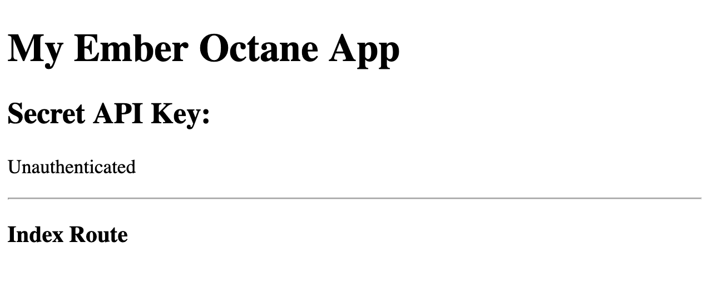

[Back to Main README](../README.md)

# Full GitHub Authorization with the `torii-provider`

This guide walks through the process of authenticating and authorizing an Ember app with
and for use against GitHub using `ember-simple-auth` and `torii` including a registered
GitHub application, an unauthenticated login route, an authenticated content route, a
token exchange service, and use of an authorizer to inject the token into
requests. We'll use the [ember-data-github](https://github.com/elwayman02/ember-data-github)
addon so we don't need to create our own GitHub models, serializers, and adapters.

The overall flow, concerns, and approach are the same for all OAuth2 explicit grant flow
mechanisms like Facebook, Google, etc. The differences could be as small as changing some
configuration and base classes. For GitHub specifically, the authentication flow works like this:

1. When the user clicks the login button, the Ember application contacts
   `https://github.com/login/oauth/authorize` with the app’s `client_id`.
   GitHub presents a new window asking the user to authorize access to their
   GitHub account from the app. The user grants this.
2. GitHub redirects back to the app with an `authorizationCode`. This is
   proof of authorization, but the app still doesn’t know _who_ the user is
   (so it cannot connect to a `User` model, for example).
3. The app sends the `authorizationCode` to a server maintained by the app's author,
   which in turn `POST`s the code to
   `https://github.com/login/oauth/access_token`. In development, this can be
   mocked. In production, it must be a separate server, about which more
   below.
4. GitHub responds to the `POST` with an `access_token`, which the
   server forwards to the app.
5. The app uses the `access_token` in an `Authorization: Bearer
   <access_token>` header request to, say, `https://api.github.com/user`,
   which returns the GitHub user’s user info, at which point it can be matched to the app's own `User` model. 

You can find a sequence diagram for the full flow [here](./assets/esa-initial-flow.svg).

This guide assumes you know how to start an Ember app and are familiar with the various
files and concepts.

## Registering your app with GitHub

After logging in to GitHub, go to your [developer
settings](https://github.com/settings/developers) and, in the “OAuth Apps”
section, click on “New OAuth App.” Fill in the form much like in this image.
The first three fields can be filled out per your wishes, but take care with
the Authorization callback URL.


You will likely want to register different application keys for development
and production, as the authorization callback URL will be different in both
cases. For development, `http://localhost:4200/torii/redirect.html` is
sufficient. For production, it will be
`http://<your-great-app-domain>/torii/redirect.html`.

Once you register your application, you will have a chance to add an
application logo.  Most importantly, you will be given a client ID and a
client secret. _The client secret must be kept secret and should never be
included in the Ember application's source!_ You will use the client ID in
your web application and the client secret in your back end token exchange
service.

## Authenticating the Ember app

OAuth is officially an authorization protocol, but is commonly used also for
authentication when the initial authorization code is obtained over `https`. GitHub uses
the OAuth [authorization code grant type](https://tools.ietf.org/html/rfc6749#section-4.1),
which requires two steps. The first step uses your client ID to get a temporary
authorization code. The temporary authorization code acts as a single use bridge
to authorization. The second step takes that authorization code and sends it to
your token exchange service which combines it with your client secret to obtain
an authorization token. That token is effectively your unique password to use
the GitHub APIs as long as it is valid.

### Installing the addons

Install `ember-simple-auth` and `torii`.

```
ember install ember-simple-auth
ember install torii
```

Here, `ember-simple-auth` provides the underlying authentication layer, which
includes `session`, an [Ember
service](https://guides.emberjs.com/release/applications/services/) that
provides authentication persistence even when the server is restarted.
`torii` provides the abstraction needed to write the GitHub-specific
authorization provider.

### Configuration

The next step is to set up the configuration. You want your effective configuration in `config/environment.js` to look
like this.

```js
// DON'T TYPE THIS. THIS IS THE EFFECTIVE RESULT.

var ENV = {
  ...

  torii: {
    sessionServiceName: 'session',
    providers: {
      'github-oauth2': {
        apiKey: 'YOUR_API_KEY',
        redirectUri: 'http://localhost:4200/torii/redirect.html',
        scope: 'repo user'
      }
    }
  }
};
```

`YOUR_API_KEY` is the client ID supplied when you registered your GitHub application.

However, this API key is probably specific to your development environment, as is the value given for `redirectUri`
above. This is fine while your app is in development, but as your application approaches production, you'll need to
break some of it out.

Additionally, it can be considered bad practice to distribute all of your API keys in your source code. Let's add a
little complexity and address this concern by using `ember-cli-dotenv` to put our key in an external file that will be
injected at build time. Install the package

```js
ember install ember-cli-dotenv
```

`ember-cli-dotenv` requires the preexistence of a configuration file before it will
install, so create the new file, `config/dotenv.js`:

```javascript
// config/dotenv.js
module.exports = function() {
  return {
    clientAllowedKeys: [
      "GITHUB_REDIRECT_URI",
      "GITHUB_CLIENT_ID",
      "AUTH_TOKEN_EXCHANGE_URL"
    ],
    failOnMissingKey: false
  };
};
```

and create a `.env` file in the root of your project like

```
GITHUB_CLIENT_ID=<your GitHub client id created above>
GITHUB_REDIRECT_URI=http://localhost:4200/torii/redirect.html
```

replacing `<YOUR_API_KEY>` with the client ID from your application registration. Add `/.env` to your `.gitignore` file
so it will not be committed.

Add the configuration for Torii to the `environment.js` like so:

```js
  var ENV = {
    ...

    torii: {
      sessionServiceName: "session",
      providers: {
        "github-oauth2": {
          scope: "repo user",
          apiKey: process.env.GITHUB_CLIENT_ID,
          redirectUri: process.env.GITHUB_REDIRECT_URI
        }
      }
    },
  };
```

### The Basic App

Let's give ourselves an app to secure. We'll keep it simple. We'll have a login route for authentication and use the
application index route to display the authenticated user's data, an operation that gives a 401 if you aren't
authenticated.

```
ember g route application
ember g controller application
ember g route index
ember g route login
```

Ember-cli will ask about overwriting app/templates/application.hbs. It's fine to do so.

Also, now is a good time to remove `ember-welcome-page` from your `package.json`.

Let's put some content in our templates. First, our `application.hbs` will give a friendly greeting and some useful
information so we know things are working as we proceed.

```handlebars
{{!-- app/templates/application.hbs --}}
<h1>My Ember Octane App</h1>
<h2>Secret API Key: {{this.config.apiKey}}</h2>

<p>
  {{#if this.session.isAuthenticated}}
    Authenticated <br>
    <button {{on "click" this.logout}}>Log Out</button>
  {{else}}
    Unauthenticated
  {{/if}}
</p>
<hr>

{{outlet}}
```

```js
// app/controllers/application.js

import Controller from '@ember/controller';
import { inject as service } from '@ember/service';
import config from '../config/environment';

export default class ApplicationController extends Controller {
  @service session;
  config = config.torii.providers['github-oauth2'];
}
```

For the `index.hbs` let's put a placeholder until we're ready to fill in real data.

```handlebars
{{!-- app/templates/index.hbs --}}
<h3>Index Route</h3>
{{#if this.session.data.authenticated.authorizationCode}}
  <p>Authorization Code: {{this.session.data.authenticated.authorizationCode}}</p>
{{/if}}
```

Finally, we'll put a placeholder in `login.hbs`. We'll give it behavior shortly.

```handlebars
{{!-- app/templates/login.hbs --}}
<h3>Login Route</h3>
<button>Log in to GitHub</button>
```

We can ignore the rest of the generated files for this step.
 
When you spin up the server again with `ember serve`, you should see, at
`http://localhost:4200`, something like this:



### Adding Authentication

First, we'll designate the `index` route as an authenticated route using the
session service's
[requireAuthentication](http://ember-simple-auth.com/api/classes/SessionService.html#method_requireAuthentication)
method. This will make the route inaccessible until we finish the
authentication. It will automatically redirect you to the specified login
route, if you are not authenticated.

```js
// app/routes/index.js
import Route from '@ember/routing';
import { inject as service } from '@ember/service';

export default IndexRoute extends Route {
  @service session;

  beforeModel(transition) {
    this.get('session').requireAuthentication(transition, 'login');
  },
}
```

If you're still running the app when you save this, you will see it redirect to the `login` route.

We'll also designate the `login` route as available for unauthenticated access only by calling the session service's
[prohibitAuthentication](http://ember-simple-auth.com/api/classes/SessionService.html#method_prohibitAuthentication).
This will redirect you to the `index` route.

Next, we'll create and set up our torii authenticator to start.

```sh
ember g authenticator torii
```

```js
// app/authenticators/torii.js

import { inject as service } from '@ember/service';
import Torii from 'ember-simple-auth/authenticators/torii';

export default class ToriiAuthenticator extends Torii {
  @service torii;
}
```

We also need to define a Torii provider. Because Torii doesn't provide a generator, we need to create the `app/torii-providers`
directory ourselves and create the following `github.js` inside it.

```js
// app/torii-providers/github.js

import GitHubOAuth2 from 'torii/providers/github-oauth2';

export default class GithubToriiProvider extends GitHubOAuth2 {
  fetch(data) {
    return data;
  }
}
```

There's only one more piece in this step, connecting our "Log in" button to the authentication mechanism. First, add a
`login` controller with an action.

```
ember g controller login
```

```js
// app/controllers/login.js
  
import Controller from '@ember/controller';
import { inject as service } from '@ember/service';
import { action } from '@ember/object';

export default class LoginController extends Controller {
  @service session;

  @action
  login() {
    this.session.authenticate('authenticator:torii', 'github');
  }
}
```

Finally, change your `login` template to send the action when the button is pressed.

```handlebars
{{!-- app/templates/login.hbs --}}

<button {{on "click" this.login}}>Log in to GitHub</button>
```

We've now established the mechanism to obtain an authorization code from GitHub. This doesn't authorize us fully to use
the GitHub APIs, although `ember-simple-auth` considers us authenticated at this point, but we can add some information
to our `application` template that at least verifies things work so far. Add the following line to your `application.hbs`
after the `API Key` line. When you attempt to login, you should see a popup asking your permission for the app to access
your account and it will show the authorization code. It will only ask your permission the first time. After that, the
popup will flash quickly unless you revoke the application's access through GitHub.

```handlebars
Authorization Code: {{session.data.authenticated.authorizationCode}} <br />
```

### Logging Out

Before we finish the authentication, let's add the ability to log out. This will help us reset our application so we can
test it as we go.

First, we'll add a logout button to our `application` template right after the text "Authenticated". This seems a
reasonable place since it serves as our application's rudimentary menu bar and should only show when the user is
authenticated.

```handlebars
{{!-- add to app/templates/application.hbs --}}

    <button {{on "click" this.logout}}>Log Out</button>
```

Next, add the `logout` action to your `application` controller.

```js
// add to app/controllers/application.js

  @actions
  logout() {
    this.session.invalidate();
  }
```

Clicking the "Log Out" button will take you back to the login state.

### Obtaining an Access Token

The final step in the process is to exchange your authorization code for an API access token. This can only be done
securely through a back end service because it needs to know your client secret. Right now, our app looks like
it's authenticated, but it is not _authorized_ to use the GitHub APIs. Let's add `ember-fetch` and `ember-data-github` and make our
index page show some data about the currently logged in user.

```
ember install ember-fetch
ember install ember-data-github
```

If you still have your `ember serve` running, you will probably want to stop and restart it to make sure the new models
are loaded from the addon.

Next, we'll add a `model` hook to our `index` route to load the user data.

```js
// add to app/routes/index.js

  model() {
    return this.store.findRecord('github-user', '#');
  }
```

The `ember-data-github` addon uses "#" as a special ID value to indicate the current user.

While "Me" may have been truthful in the description of the current user, it doesn't require an API call to GitHub and
isn't very informative. Change the contents of your `index` template to show some model attributes.

```handlebars
{{!-- app/templates/index.hbs --}}

 <br />
Login: {{this.model.login}} <br />
Full Name: {{this.model.name}}
```

If you log in to GitHub through the app now with the console open, you will see that you are not fully authorized. The
page will be blank (we didn't do any real error handling) and the console will tell you you received a
`401 (Unauthorized)` for an API call to `https://api.github.com/user`. This particular API uses the identity associated
with the authorized user to return the profile for that user, which it can't do if you're not authorized. Now that we
have evidence that we're not truly authorized, let's fix it.

We need to have a token exchange service, a service that takes an authorization code and returns an access token. You
can implement this in any language and stack you want for writing APIs. This guide explains how to implement the service as
an Ember `http-mock` or using [Gatekeeper](prose/gatekeeper).

#### Using an `http-mock`

Because it's a `POST` request, we need to add the `body-parser` package to parse
the request body.

```
ember g http-mock token
npm install --save-dev body-parser
```

To keep our client secret secret, we'll add the following setting to the `.env` file.

```
GITHUB_CLIENT_SECRET=<YOUR CLIENT SECRET>
GITHUB_USER_AGENT=<YOUR APPLICATION NAME>
```

In production, you'll want to have these settings and your client ID deployed with your service. You may want to
change the key names in the `.env` file and the code depending on how you distinguish development from production.

We can now implement our back end token exchange service.

```js
// server/mocks/token.js

module.exports = function(app) {
  const express = require('express');
  const tokenRouter = express.Router();
  const https = require('https');

  tokenRouter.post('/', function(req, res) {
    const body = req.body;

    const payload = {
      'client_id': process.env.GITHUB_CLIENT_ID,
      'client_secret': process.env.GITHUB_CLIENT_SECRET,
      'code': body.authorizationCode
    };
    if (body.state) {
      payload.state = body.state;
    }

    const data = JSON.stringify(payload);

    const options = {
      hostname: 'github.com',
      port: 443,
      path: '/login/oauth/access_token',
      method: 'POST',
      headers: {
        'Content-Type': 'application/json',
        'Content-Length': Buffer.byteLength(data),
        'Accept': 'application/json',
        'User-Agent': process.env.GITHUB_USER_AGENT
      }
    };

    const ghReq = https.request(options, (ghRes) => {
      let body = '';
      ghRes.setEncoding('utf8');
      ghRes.on('data', (chunk) => body += chunk);
      ghRes.on('end', () => {
        res.writeHead(200, {
          'Content-Type': 'application/json'
        });
        res.write(JSON.stringify(body));
        res.end();
      });
    });
    ghReq.on('error', (error) => {
      console.error(error);
      res.status(500).end();
    });
    ghReq.write(data);
    ghReq.end();
  });

  app.use('/api/token', require('body-parser').json());
  app.use('/api/token', tokenRouter);
};
```

It creates a payload out of the `authorizationCode` and optionally `state` sent to it as well as the `client_id` and
`client_secret` taken from your `.env`. It sends them to the `/login/oauth/access_token` endpoint,
takes GitHub's response and returns it verbatim. The resulting access token will be in an `access_token` property of
the JSON. We aren't going to run this through Ember Data, so the result does not need to be JSONAPI.

#### Using Gatekeeper

This aspect of the guide takes place outside of the context of your Ember app,
because GitHub will not permit token exchange to happen on a client-side
application. Luckily, spinning up a separate gatekeeper server is somewhat
straightforward, and there even is a Node application,
[Gatekeeper](prose/gatekeeper), designed to make the process even easier.

In short, the server must receive the authorization code your Ember app receives
from GitHub and forward it back to GitHub in a `POST` request, wait for a
response, and send it back to your Ember app.

Gatekeeper expects the authorization code to come at the end of a URL in the
format of `http://<gatekeeper-server>/authenticate/<authorization-code>`,
which is why we set the value of `AUTH_TOKEN_EXCHANGE_URL` to
`http://localhost:9999/authenticate` in the `.env` file. This is the URL we
will shortly be using.

##### Build the Gatekeeper Server

Outside of your Ember app’s directory, clone and prepare the Gatekeeper
server:

```sh
git clone https://github.com/prose/gatekeeper.git
cd gatekeeper
npm install
npm install dotenv
echo ".env" >> .gitignore
```

Now, as with the `.env` file in the Ember app, create a similar one in the
`gatekeeper` directory:

```sh
OAUTH_CLIENT_ID=<your GitHub client id created above>
OAUTH_CLIENT_SECRET=<your GitHub client secret created above>
```

Note that for the token exchange, you need both the client id _and_ the client
secret. These are the environment variable names Gatekeeper is expecting, so
do not change them. Finally, make the Gatekeeper server aware of the
environment variables by adding, at the very top of `index.js`:

```javascript
require("dotenv").config();
```

Start the Gatekeeper server with:

```sh
node index.js
```

The server should report to the console something like this:

```
Configuration
oauth_client_id: 5cb***
oauth_client_secret: 429***
oauth_host: github.com
oauth_port: 443
oauth_path: /login/oauth/access_token
oauth_method: POST
Gatekeeper, at your service: http://localhost:9999
```

The lines for the `oauth_client_id` and `oauth_client_secret` should look
similar to your client id and client secret. If they read `GIT***`, then the
environment variables did not catch. Make sure you added the `dotenv`
configuration line at the top of `index.js`.

#### Connecting the Torii authenticator

Our application will need to know the URL of the token exchange API. While this is not an established part of the Torii
configuration, that is a reasonable place to put it. Add `AUTH_TOKEN_EXCHANGE_URL=http://localhost:4200/api/token` to your
`.env` and the following to the development section of your `environment.js`. __Note that you should use `https` for the
token exchange service in production!__

```js
// change config/environment.js

  var ENV = {
    ...

    torii: {
      sessionServiceName: "session",
      providers: {
        "github-oauth2": {
          scope: "repo user",
          apiKey: process.env.GITHUB_CLIENT_ID,
          redirectUri: process.env.GITHUB_REDIRECT_URI,
          tokenExchangeUri = process.env.AUTH_TOKEN_EXCHANGE_URL
        }
      }
    },
  };
```

Now that we've set up a token exchange service, let's use it. Replace your `torii` authenticator with

```js
// app/authenticators/torii.js

import { inject as service } from '@ember/service';
import Torii from 'ember-simple-auth/authenticators/torii';
import config from '../config/environment';

export default class ToriiAuthenticator extends Torii {
  @service torii;
  @service ajax;

  async authenticate() {
    const tokenExchangeUri = config.torii.providers['github-oauth2'].tokenExchangeUri;

    let data = await super.authenticate(...arguments);
    let response = await this.ajax.request(tokenExchangeUri, {
      type: 'POST',
      crossDomain: true,
      dataType: 'json',
      contentType: 'application/json',
      data: JSON.stringify({
        authorizationCode: data.authorizationCode
    });

    return {
      access_token: JSON.parse(response).access_token,
      provider: data.provider
    };
  }
});
```

This makes a `POST` request to your service and gives the response back to Ember Simple Auth. Notice that it returns the `access_token`
and the `provider` but omits the `authorizationCode`. The authorization code is a one-time use token and is not valid
after being exchanged.

We're getting close now. We have an access token. We just need to use it.

### Using The Access Token

The trick now is to get the access token into the `Authorization` header for every HTTP request. If you look at GitHub's documentation,
they say you need to send your token with the HTTP header `Authentication: token OAUTH-TOKEN`. This can be done in an Ember Data adapter.
If GitHub is the only data source we need for the application or at least the one we want to consider primary, we can create an `application`
adapter. If we consider it the secondary data source, then we need to create an adapter per model. Because `ember-data-github` has several
per-model adapters, we'll create the `github-user` adapter to start us off.

```
ember g adapter github-user
```

```js
// app/adapters/github-user.js

import { computed } from '@ember/object';
import GitHubUserAdapter from 'ember-data-github/adapters/github-user';
import { inject as service } from '@ember/service';

export default class GithubUserAdapter extends GitHubUserAdapter {
  @service session;

  @computed("session.data.authenticated.access_token")
  get headers() {
    const headers = {};
    if (this.session.isAuthenticated) {
      headers.Authorization = `token ${
        this.session.data.authenticated.access_token
      }`;
    }

    return headers;
  }
}
```

This adapter injects an authorization header into the GitHub request now.

### Wrapping Up

So that's it! You should be able to log in to GitHub, see your avatar and some data about yourself, and log out.

The app certainly lacks polish. The UI is crude and, as we saw, there are opportunities for better error handling.

## Useful Links

In addition to the documentation and source code for `ember-simple-auth` and `torii`, the
following posts and projects were helpful in assembling the full story presented in this
guide.

* [simple-auth-torii-github-demo](https://github.com/srvance/simple-auth-torii-github-demo) is a repo created to follow
the steps of this guide. All elements of the guide except the token exchange service are contained here. The demo project uses pre-Octane Ember patterns.
* [@muziejus/ember-simple-auth-github-octane](http://github.com/muziejus/ember-simple-auth-github-octane) is another demo following the steps
in this guide but using Ember Octane patterns.
* [github-stars](https://github.com/hawkup/github-stars) has multiple implementations of the
same app to display your starred repos in various web app frameworks. The `emberjs`
directory contains the implementation for Ember.
* [GitHub Social Authentication with Ember Simple Auth and Torii](https://disjoint.ca/til/2016/03/21/github-social-authentication-with-ember-simple-auth-and-torii/)
addresses some very specific issues but has a helpful overall recipe to get things working.
* [Real-world Authentication with Ember Simple Auth](https://emberigniter.com/real-world-authentication-with-ember-simple-auth/)
adds `ember-simple-auth` to the application developed in its preceding post.
* The [GitHub OAuth Web Application Flow](https://developer.github.com/v3/oauth/#web-application-flow)
tells you what GitHub expects of your app.
