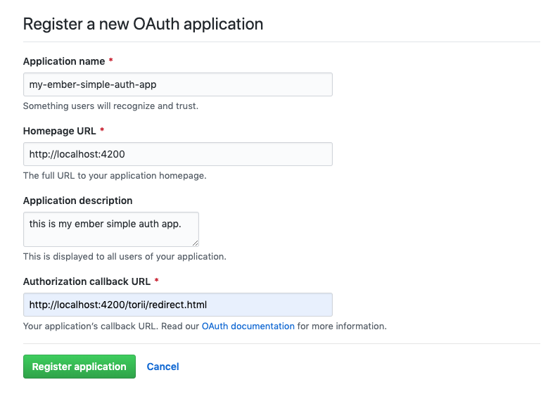

[Back to Main README](../README.md)

# Full GitHub Authorization with the `torii-provider`

This guide walks through the process of authenticating and authorizing an Ember app with
and for use against GitHub using `ember-simple-auth` and `torii` including a registered
GitHub application, an unauthenticated login route, an authenticated content route, an
AWS Lambda-based token exchange service, and use of an authorizer to inject the token
into requests. We'll use the [ember-data-github](https://github.com/elwayman02/ember-data-github)
addon so we don't need to create our own GitHub models, serializers, and adapters.

While most of the pieces are documented in the `ember-simple-auth` and `torii`
documentation, putting them together properly for the particular scenario has not been
fully documented to date. Additionally, many of the sources on the general internet are
helpful but dated or incomplete.

This guide assumes you know how to start an Ember app and are familiar with the various
files and concepts.

## Registering your app with GitHub

Go to your GitHub Settings, choose `OAuth Applications`, and press the `Register a new
application` button. Fill in the fields similar to the following.



You will likely want to register different application keys for different deployment stages
because of the differences in the `Authorization callback URL`.

Once you register your application, you will have a chance to add an application logo.
Most importantly, you will be given a client ID and a client secret. _The client secret is
a password and should be protected as such!_ You will use the client ID in your web
application and the client secret in your back end token exchange service.

## Authenticating the Ember app

OAuth is officially an authorization protocol, but is commonly used also for
authentication when the initial authorization code is obtained over `https`. GitHub uses
the OAuth authorization code grant type, which requires two steps. The first step uses
your client ID to get a temporary authorization code. The temporary authorization code
acts as a single use bridge to authorization. The second step takes that authorization
code and sends it to your token exchange service which combines it with your client
secret to obtain an authorization token. That token is effectively your unique password
to use the GitHub APIs as long as it is valid.

### Installing the addons

Install `ember-simple-auth` and `torii`.

```
ember install ember-simple-auth
ember install torii
```

### Configuration

The next step is to set up the configuration. You want your effective configuration in `config/environment.js` to look
like this.

```js
// DON'T TYPE THIS. THIS IS THE EFFECTIVE RESULT.

var ENV = {
  ...

  torii: {
    sessionServiceName: 'session',
    providers: {
      'github-oauth2': {
        apiKey: 'YOUR_API_KEY',
        redirectUri: 'http://localhost:4200',
        scope: 'repo user'
      }
    }
  }
};
```

`YOUR_API_KEY` is the client ID supplied when you registered your GitHub application.

However, this API key is probably specific to your development environment, as is the value given for `redirectUri`
above. This is fine while your app is in development, but as your application approaches production, you'll need to
break some of it out.

Additionally, it can be considered bad practice to distribute all of your API keys in your source code. Let's add a
little complexity and address this concern by using `ember-cli-dotenv` to put our key in an external file that will be
injected at build time. Install the package

```js
ember install ember-cli-dotenv
```

and create a `.env` file in the root of your project like

```
GITHUB_DEV_CLIENT_ID=<YOUR_API_KEY>
```

replacing `<YOUR_API_KEY>` with the client ID from your application registration.

Break the configuration into the stage-specific parts of your `environment.js` like so.

```js
  var ENV = {
    ...

    torii: {
      sessionServiceName: 'session',
      providers: {
        'github-oauth2': {
          scope: 'repo user'
        }
      }
    }
  };

  if(environment === 'development') {
    ENV.torii.providers['github-oauth2'].apiKey = process.env.GITHUB_DEV_CLIENT_ID;
    ENV.torii.providers['github-oauth2'].redirectUri = 'http://localhost:4200';
  }
```

The values in the `development` block are the ones specific to that stage. You may choose to reuse those for the `test`
stage, but you will need different ones for `production` as at least the API key will change and you will almost
definitely host the application under a domain name. We will add to the `development` block later.

### The Basic App

Let's give ourselves an app to secure. We'll keep it simple. We'll have a login route for authentication and use the
application index route to display the authenticated user's data, an operation that gives a 401 if you aren't
authenticated.

```
ember g route application
ember g controller application
ember g route index
ember g route login
```

Also, now is a good time to remove `ember-welcome-page` from your `package.json`.

Let's put some content in our templates. First, our `application.hbs` will give a friendly greeting and some useful
information so we know things are working as we proceed.

```handlebars
<!-- app/templates/application.hbs -->

<h1>Welcome to the Demo App!</h1>

API Key: {{config.apiKey}} <br />

{{#if session.isAuthenticated}}
    Authenticated
{{else}}
    Unauthenticated
{{/if}}

<hr />

{{outlet}}
```

The `session` service is automatically injected, so there's no code for that. We'll add the `config` entry for now to
verify that our `dotenv` configuration is working.

```js
// app/controllers/application.js

import Ember from 'ember';
import config from '../config/environment';

export default Ember.Controller.extend({
  config: config.torii.providers['github-oauth2']
});
```

For the `index.hbs` let's put a placeholder until we're ready to fill in real data.

```handlebars
{{!-- app/templates/index.hbs}}

<h1>Me</h1>
```

Finally, we'll put a placeholder in `login.hbs`. We'll give it behavior shortly.

```handlebars
{{!-- app/templates/login.hbs}}

<button>Log in to GitHub</button>
```

We can ignore the rest of the generated files for this step.
 
You can test the app so far by running `ember serve` and pointing your browser to `http://localhost:4200/` and
`http://localhost:4200/login`.

### Adding Authentication

We added the configuration for our authentication, but we didn't yet add the pieces that use it. Let's do that first.

```
ember g authenticator torii
```

and we'll modify our application and routes with some useful mixins.

First, we'll add the [ApplicationRouteMixin](http://ember-simple-auth.com/api/classes/ApplicationRouteMixin.html) to
our application route. This is optional, but adds methods supporting the authentication lifecycle that we would
otherwise have to implement explicitly.

```js
import Ember from 'ember';
import ApplicationRouteMixin from 'ember-simple-auth/mixins/application-route-mixin';

export default Ember.Route.extend(ApplicationRouteMixin, {
});
```

Next, we'll designate the `index` route as an authenticated route using the
[AuthenticatedRouteMixin](http://ember-simple-auth.com/api/classes/AuthenticatedRouteMixin.html). This will make the
route inaccessible until we finish the authentication. It will automatically redirect you to the specified login route,
by default `login`, if you are not authenticated.

```js
// app/routes/index.js

import Ember from 'ember';
import AuthenticatedRouteMixin from 'ember-simple-auth/mixins/authenticated-route-mixin';

export default Ember.Route.extend(AuthenticatedRouteMixin, {
});
```

If you're still running the app when you save this, you will see it redirect to the `login` route.

We'll also designate the `login` route as available for unauthenticated access by applying the
[UnauthenticatedRouteMixin](http://ember-simple-auth.com/api/classes/UnauthenticatedRouteMixin.html) to it. This will
redirect you to the `routeIfAlreadyAuthenticated` which defaults to `index`. As you can see, `ember-simple-auth` has
sensible and convenient defaults.

Next, we'll set up our torii authenticator to start.

```js
// app/authenticators/torii.js

import Ember from 'ember';
import ToriiAuthenticator from 'ember-simple-auth/authenticators/torii';

export default ToriiAuthenticator.extend({
  torii: Ember.inject.service()
});
```

We also need to define a Torii provider. Because Torii doesn't provide a generator, we need to create the `app/torii-providers`
directory ourselves and create the following `github.js` inside it.

```js
// app/torii-providers/github.js

import GitHubOAuth2Provider from 'torii/providers/github-oauth2';

export default GitHubOAuth2Provider.extend({
  fetch(data) {
    return data;
  }
});
```

There's only one more piece in this step, connecting our "Log in" button to the authentication mechanism. First, add an
action to your `login` route.

```js
  // add to app/routes/login.js
  
  actions: {
    login() {
      this.get('session').authenticate('authenticator:torii', 'github');
    }
  }
```

Finally, change your `login` template to send the action when the button is pressed.

```handlebars
{{!-- app/templates/login.hbs --}}

<button {{action "login"}}>Log in to GitHub</button>
```

We've now established the mechanism to obtain an authorization code from GitHub. This doesn't authorize us fully to use
the GitHub APIs, although `ember-simple-auth` considers us authenticated at this point, but we can add some information
to our `application` template that at least verifies things work so far. Add the following line to your `application.hbs`
after the `API Key` line. When you attempt to login, you should see a popup asking your permission for the app to access
your account and it will show the authorization code. It will only ask your permission the first time. After that, the
popup will flash quickly unless you revoke the application's access through GitHub.

```handlebars
Authorization Code: {{session.data.authenticated.authorizationCode}} <br />
```

### Logging Out

Before we finish the authentication, let's add the ability to log out. This will help us reset our application so we can
test it as we go.

First, we'll add a logout button to our `application` template right after the text "Authenticated". This seems a
reasonable place since it serves as our application's rudimentary menu bar and should only show when the user is
authenticated.

```handlebars
{{!-- add to app/templates/application.hbs --}}

    <button {{action "logout"}}>Log Out</button>
```

Next, add the `logout` action to your `application` controller.

```js
// add to app/controllers/application.js

  actions: {
    logout() {
      this.get('session').invalidate();
    },
  }
```

Clicking the "Log Out" button will take you back to the login state.

## Useful Links

In addition to the documentation and source code for `ember-simple-auth` and `torii`, the
following posts and projects were helpful in assembling the full story presented in this
guide.

* [github-stars](https://github.com/hawkup/github-stars) has multiple implementations of the
same app to display your starred repos in various web app frameworks. The `emberjs`
directory contains the implementation for Ember.
* [GitHub Social Authentication with Ember Simple Auth and Torii](https://disjoint.ca/til/2016/03/21/github-social-authentication-with-ember-simple-auth-and-torii/)
addresses some very specific issues but has a helpful overall recipe to get things working.
* [Real-world Authentication with Ember Simple Auth](https://emberigniter.com/real-world-authentication-with-ember-simple-auth/)
adds `ember-simple-auth` to the application developed in its preceding post.
* The [GitHub OAuth Web Application Flow](https://developer.github.com/v3/oauth/#web-application-flow)
tells you what GitHub expects of your app.
